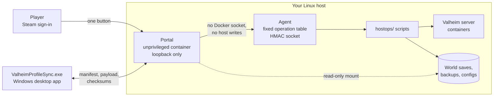

# Valheim Portal

### *Fight trolls, not mods.*

[](LICENSE)
[](go.mod)
[](docs/prerequisites.md)
[](docs/client-install.md)

**Valheim Portal keeps a group of modded Valheim servers, and everyone who plays on
them, on exactly the same mod list — without asking any player to touch a mod
manager.**

Running a modded Valheim server for friends is mostly an exercise in version drift.
Somebody updates one plugin, somebody else never updated at all, and the evening is
spent diffing `BepInEx/plugins` over voice chat instead of playing. The usual answer is
"install r2modman and import this code", which works right up until the code changes.

This project takes the other route. The operator publishes an **immutable profile
release** — an exact package list with a SHA-256 for every archive — and each player
gets one desktop application that installs precisely that, verifies every byte,
activates it atomically, and launches Steam Valheim. Players click one button on a web
page. They never see a mod list, never pick a version, and cannot end up with a
different one.

Reasons you might want it:

* **Nobody drifts.** A release is a scope — world, profile, client type, version — and
  the client either has that exact generation installed or installs it. A failed or
  interrupted update leaves the previous working generation active.
* **Flat and VR from the same world.** Both client types can be published for one
  world, so a VR player and a desktop player join the same server with profiles that
  agree about what is loaded.
* **Access is Steam identity, not a shared password.** Players sign in with Steam;
  the operator grants access per world. Profile links carry no token, no path, and no
  secret, so a leaked link grants nothing.
* **Server operations without a shell.** Start, stop, back up, restore, change ports,
  deploy mods, create and delete worlds — from an admin page, each as a fixed,
  backup-first sequence with typed confirmations on the destructive ones.
* **Privilege is separated on purpose.** The web process holds no Docker socket and
  writes nothing on the host. Everything privileged goes through a small agent that
  accepts only a fixed table of operations over an HMAC-authenticated socket.

It is single-tenant by construction: one operator, one host, a handful of worlds. It is
not a hosted service and does not try to be.

Licensed under **AGPL-3.0** — see [LICENSE](LICENSE). If you run a modified copy as a
network service, you owe its source to its users.



## What it does

| Area | Capability |
|---|---|
| **Profiles** | Immutable releases scoped by world, profile, client type and version, with a SHA-256 for every archive |
| **Client types** | Desktop, Desktop VR-compatible, and VR headset profiles for the same world |
| **Player access** | Steam OpenID sign-in, per-world grants, RFC 8628 device authorisation with a typed confirmation code |
| **Installation** | Atomic profile generations, resumable downloads, checksum verification, rollback to the previous generation |
| **Server operations** | Start, stop, pause, restart, back up, restore, change ports, capture logs and diagnostics |
| **World lifecycle** | Transactional creation from a seed or an imported save, registration, permanent deletion behind a typed phrase |
| **Mods** | Thunderstore and custom package management, dependency resolution, deploy with a reviewed diff |
| **Live status** | Online/offline measured from each container's own Steam A2S report, not an operator toggle |
| **World intel** | Rendered world maps, biome and location analysis, seed metadata |
| **Auditing** | Every privileged action recorded with actor, target and timestamp |

## What it looks like

A player signs in with Steam and sees only the worlds they have been granted.


Opening a world offers one card per client type. The card copy is derived from the
published profile definition rather than the release's `client_type`, so a profile
that installs ValheimVR can never be labelled plain Desktop.


The operator's side is one page. Every world exposes its lifecycle actions, access,
releases, mods and activity, and every button maps to a fixed, signed operation sent
to the privileged host agent.


Each world renders a browsable map from its own save file, with biome and location
layers, save-health analysis, and a diff against the previous backup.


## Repository layout

This repository is self-contained: clone it anywhere. It carries the Go portal, the
host operation scripts the agent executes, and the Python tools those scripts delegate
to.

```text
valheim-portal/
├── cmd/, internal/, client/   # the Go portal and its Windows client
├── hostops/                   # AGENT_SCRIPT_DIR: the 20 scripts the agent executes
│   ├── lib/common.sh          # shared resolvers every script sources
│   └── tests/                 # bash regression tests for the scripts
├── tools/                     # Python the scripts delegate to, plus the VR mod scanners
└── scripts/                   # installer and build tooling
```

Two directories stay outside it, because neither belongs to this project. **You set two
variables, once each:**

| Set this | To a directory like | Holding |
|---|---|---|
| `VALHEIM_WORLD_ROOT` | `/srv/valheim` | one subdirectory per world, plus `world_backups` — your save data |
| `VALHEIM_SERVER_DOCKER_DIR` | `/srv/valheim-server-docker` | a checkout of the modified [valheim-server-docker](https://github.com/lloesche/valheim-server-docker) fork, Apache-2.0, whose compose project every lifecycle script drives |

```text
/srv/valheim/                 <- VALHEIM_WORLD_ROOT points here
├── MyWorld/
├── AnotherWorld/
└── world_backups/
```

If you install with `scripts/install-portal.sh`, set both in `deploy/install.conf` and
you are done — the installer writes them into the container's `.env` and the agent's
`/etc/valheim-portal/agent.env` for you.

> **You may see two other names for the world root and you never set them.**
> `AGENT_WORLD_ROOT` is what the installer hands the agent process, and `VALHEIM_ROOT`
> is what the `hostops/` scripts call it internally. All three mean the same directory;
> the scripts accept whichever is present. Set `VALHEIM_WORLD_ROOT` and ignore the rest.

Neither has a default. A script that needs one and does not find it exits 78 with a
message naming the variable and showing the layout it expects, rather than guessing a
path it would then stop or delete a server in. See
[docs/repository-layout.md](docs/repository-layout.md); versions and host requirements
are in [docs/prerequisites.md](docs/prerequisites.md).

**Build gotcha.** If your checkout happens to sit inside another VCS working copy, plain
`go build ./...` fails with `multiple VCS detected`. Use:

```sh
go build -buildvcs=false ./...
```

The shipped build scripts already pass it.

## Installation

```sh
# 1. This repository, and the server checkout its scripts drive.
git clone https://github.com/neuralyze/valheim-portal.git /srv/valheim-portal
cd /srv/valheim-portal
git clone https://github.com/lloesche/valheim-server-docker.git /srv/valheim-server-docker
printf 'PUID=1000\nPGID=1000\n' > /srv/valheim-server-docker/default.env

# 2. The two operator data files. Edit both to your real worlds.
cp hostops/worlds.txt.example hostops/worlds.txt
cp release-targets.json.example release-targets.json

# 3. Deployment configuration: base URL, proxy CIDR, world root,
#    server checkout, allowed worlds.
cp deploy/install.conf.example deploy/install.conf

# 4. Preview, then install.
sudo ./scripts/install-portal.sh install --config deploy/install.conf --dry-run
sudo ./scripts/install-portal.sh install --config deploy/install.conf
```

Then point your reverse proxy at `127.0.0.1:18080`, have it send
`X-Portal-Admin-Token` on `/admin` and blank both identity headers everywhere else,
and confirm the whole boundary:

```sh
sudo ./scripts/install-portal.sh verify --config deploy/install.conf
```

**Step 2 is the one that fails silently.** A world missing from `hostops/worlds.txt`
is never backed up and the run still reports success; an absent `release-targets.json`
makes the client-release cutover guard find no targets, so a server can start without
a package every player's client release still expects.

The full walkthrough — prerequisites, the proxy configuration in detail, the security
model, upgrades and troubleshooting — is in
[docs/installation.md](docs/installation.md).

## How it works

The portal publishes Steam-authorized, immutable Valheim profile definitions and
operates a restricted server-management agent. It holds no Docker socket and writes
nothing on the host; it does mount the world tree read-only, which is how it reads
seeds, maps, and live world status. See
[docs/architecture.md](docs/architecture.md).

## Player workflow

1. Download and double-click `ValheimProfileSync.exe` once. It installs and registers itself with a visible confirmation.
2. Sign in through Steam at the portal.
3. Open an authorized world page and select **Install or update** for a profile.
4. The `valheim-profile-sync://` link starts the installed application, which shows a
   short eight-character code. Type that code into the browser's confirmation page and
   submit it.

   Opening the page authorizes nothing on its own — the code, visible only on your own
   screen, is what turns the request into a grant.

5. On the first update the application looks for Valheim in saved, registry and standard
   Steam locations. If none is valid, pick the folder containing `valheim.exe` yourself;
   **Done** stays disabled until validation succeeds. That choice is remembered.

6. It then downloads only missing or changed packages, validates every checksum,
   activates the profile atomically, creates a `<profile>.url` Desktop shortcut, and
   starts Steam Valheim.

The application stores independent profile generations under `%LOCALAPPDATA%\ValheimProfileSync\profiles`. It never copies the Steam game. It installs only the Doorstop bootstrap files required to select a profile beside `valheim.exe`; it refuses to replace a loader owned by another tool.

VR releases also carry a separate, immutable `vr_runtime` artifact. The client checksum-verifies and stages it outside Steam, then overlays only tracked ValheimVR runtime files. Switching to Flat removes only checksum-verified portal-owned runtime files; unknown or foreign files cause a safe refusal. See [ValheimVR packaging](docs/valheimvr-packaging.md).

VR-compatible Flat and VR definitions retain ValheimVR's multiplayer animation support: Flat sets `nonVrPlayer = true` and includes the non-VR companion; VR sets it to `false` and includes `vr_runtime`. True nonVR definitions use the Flat transport type but omit ValheimVR, `BackpacksVRFix`, `EpicLootVRFix`, ValheimVR configuration, and every ValheimVR artifact.

## Deployment

The portal is two deployables: an unprivileged loopback-only container and a
privileged host agent that runs a fixed table of world operations behind an
HMAC socket. Provision both with the installer:

```sh
cp deploy/install.conf.example deploy/install.conf
sudo ./scripts/install-portal.sh install --config deploy/install.conf --dry-run
sudo ./scripts/install-portal.sh install --config deploy/install.conf
```

See [prerequisites.md](docs/prerequisites.md) for what the host needs first,
[installation.md](docs/installation.md) for the security model the deployment
depends on, and [public-distribution.md](docs/public-distribution.md) for what
remains before this can be offered as a turnkey public solution. The world
operation scripts ship in `hostops/`; the installer verifies every one the agent
can invoke is present and executable before it changes anything.

Every command and build script in this repository is listed in
[command-reference.md](docs/command-reference.md); every world operation script in
`hostops/` and every Python tool in `tools/` has an entry in
[script-reference.md](docs/script-reference.md).

## Administration

Sign in with Steam: the **Administration** link appears for any SteamID64 listed in
`PORTAL_ADMIN_STEAM_IDS`, which the portal checks against the signed-in identity
itself. The reverse-proxy identity and admin-token path is retained as break-glass,
and an empty allowlist leaves it as the only way in — see
[the security model](docs/installation.md#the-security-model).

The authenticated admin site is one page of collapsible sections, ordered so server
operations come first:

* **Membership** — grant or revoke per-world access by Steam ID, and set who is an
  admin on each world. Unregistering revokes portal access without touching server
  files.
* **Server operations** — start, stop, pause, restart, back up, change the game port,
  capture logs and diagnostics. Anything that interrupts play is backup-first.
* **Mods** — manage Thunderstore and custom packages against a world's profile, then
  deploy with a reviewed diff.
* **Releases** — create, publish, batch-publish, discard and archive immutable profile
  releases and their artifacts.
* **World creation** — a random or supplied seed, or an imported save pair; copies an
  approved profile manifest, sets network, gameplay and backup values, starts the world
  with a readiness check, and publishes it only once healthy. The whole sequence is
  transactional.
* **Deletion** — requires typing an exact world-bound phrase, then disables access,
  takes a final backup, stops the server, removes its directory and archives its
  releases. External backups and immutable artifacts are retained.
* **World map and analysis** — rendered maps, biome and location analysis, seed
  metadata.
* **Audit log** — every privileged action with actor, target and timestamp.

## Profile releases

A release is scoped by world, profile, client type (`flat` or `vr`), and version. Multiple profiles for the same world and client type may be current simultaneously.

Build a deterministic profile definition from an approved managed profile manifest and client config:

```sh
./scripts/build-profile-definition.sh \
  <WORLD> <published-profile> flat \
  '<world-root>/<WORLD>/mods/profiles/<source-profile>/profile-manifest.json' \
  '<world-root>/<WORLD>/mods/profiles/<source-profile>/client-config' \
  '<world-root>/<WORLD>/mods/manager/exports/<published-profile>-profile-<version>.zip' \
  '<world-root>/<WORLD>/mods/profiles/<source-profile>/client-config-flat'
```

The three-argument form `build-profile-definition.sh <WORLD> <published-profile> flat`
derives all of those paths from `VALHEIM_PROFILE_SOURCE_ROOT`.

The builder resolves enabled package pins from the managed manifest, records each package SHA-256 and size, merges the optional client-type config overlay over the common config, and creates a canonical `profile-manifest.json` plus profile config ZIP. Build the Windows application with:

```sh
./scripts/build-windows-client.sh
```

`dist/ValheimProfileSync.exe` is tracked, because it is what the portal serves
at `/client/ValheimProfileSync.exe`. Always produce it with that script: a plain
`go build` links the console subsystem, so Windows opens an empty console window
beside the application, and it leaves the build identity unstamped so a support
bundle cannot be matched to a release. Two checks enforce this rather than
trusting the habit — `go test ./cmd/valheim-profile-sync` rejects a tracked
artifact that is console-linked, unstamped, or unstripped, and the portal refuses
to serve one, reporting the reason on `/admin` and to the download.

Publish a profile from the authenticated `/admin` release workflow. It uploads artifacts through the portal process and is the recommended production path.

`seed-release` is only for controlled host automation. Its `--database` and `--artifact-root` values are persisted in the release record and later opened by the portal container. Therefore, run it **inside a container that mounts `portal-data` at `/var/lib/valheim-portal`**:

Build the staging utility, then mount it with the production data volume:

```sh
go build -buildvcs=false -trimpath -o /tmp/seed-release ./cmd/seed-release
```

```sh
docker run --rm --user root \
  --entrypoint /seed-release \
  -v portal_portal-data:/var/lib/valheim-portal \
  -v /path/to/seed-release:/seed-release:ro \
  -v /absolute/path/<published-profile>-profile-<version>.zip:/tmp/profile.zip:ro \
  debian:bookworm-slim \
  --database /var/lib/valheim-portal/portal.sqlite \
  --artifact-root /var/lib/valheim-portal/artifacts \
  --world <WORLD> \
  --profile <published-profile> \
  --client-type flat \
  --version <version> \
  --profile-payload /tmp/profile.zip \
  --join-address 'valheim.example.com:2456' \
  --server-version '<verified Valheim server version>'
```

For VR, mount the validated runtime archive, add `--vr-runtime /tmp/vr-runtime.zip`, and use client type `vr`.

Never pass host paths such as `/var/lib/docker/volumes/portal_portal-data/_data/...` as either argument. They are valid only on the host, fail the portal container's path-containment check, and cause an authenticated client payload request to return `404`.

`seed-release` safely resumes only an exact matching incomplete draft. Archive a bad release in `/admin`; published history remains auditable. A failed local update keeps the previous profile generation active.

## Documentation

| doc | read it when |
|---|---|
| [docs/repository-layout.md](docs/repository-layout.md) | Before cloning. The required layout and the `-buildvcs=false` gotcha. |
| [docs/prerequisites.md](docs/prerequisites.md) | Before installing. Versions, ports, DNS/TLS, and what an absent Steam API key costs you. |
| [docs/installation.md](docs/installation.md) | Installing. The security model the deployment depends on. |
| [docs/operations.md](docs/operations.md) | Running it. Releases, world operations, player access, and how world status is measured. |
| [docs/development.md](docs/development.md) | Changing it. What a clean clone can and cannot verify. |
| [docs/command-reference.md](docs/command-reference.md) | Every command in `cmd/` and every script in `scripts/`. |
| [docs/architecture.md](docs/architecture.md) / [docs/threat-model.md](docs/threat-model.md) | Reviewing the design or its boundaries. |
| [docs/client-install.md](docs/client-install.md) | Helping a player install a profile. |
| [docs/release-format.md](docs/release-format.md) / [docs/valheimvr-packaging.md](docs/valheimvr-packaging.md) | Building or publishing artifacts. |
| [docs/public-distribution.md](docs/public-distribution.md) | Asking what is still rough about this as a public product. |

## Valheim, VHVR and mod compatibility

A modded Valheim client fails quietly: the mod installs, the game starts, and the feature
is simply dead in VR with no error anywhere. These five documents are the accumulated
answer to that, and they are useful even if you never deploy this portal.

| doc | the problem it solves |
|---|---|
| [docs/valheim-vr-knowledge.md](docs/valheim-vr-knowledge.md) | You need a fact about Valheim or VHVR internals and the documentation does not have it, or has it wrong. Verified against decompiled IL with `file:line` citations. Its first section is about instruments that silently read zero, and generalises past this game. |
| [docs/mod-onboarding.md](docs/mod-onboarding.md) | You want to add a mod without discovering months later that it never worked in VR. Eight stages, three gates, one recorded decision. |
| [docs/mod-decisions.md](docs/mod-decisions.md) | Someone is about to re-add a mod that was removed on purpose, or unpin a version that is pinned for a reason. |
| [docs/mod-compatibility-register.md](docs/mod-compatibility-register.md) | A package is breaking your profile and you would rather not repeat the bisection. Confirmed root causes are kept separate from packages merely bisected out. |
| [docs/vr-impact-scan.md](docs/vr-impact-scan.md) | You want the first pass automated. Documents `tools/vr_impact_scan.py`, which walks mod IL for the seven known VHVR-incompatibility classes, and `tools/vr_perf_ingest.py`, which turns a client diagnostics bundle into per-mod cost. Both exit non-zero on findings, so they gate in CI. |

## Contributing and security

[CONTRIBUTING.md](CONTRIBUTING.md) has the local check loop and the layout rules.
[CODE_OF_CONDUCT.md](CODE_OF_CONDUCT.md) applies to every interaction here.

**Do not report security issues in a public issue.** See [SECURITY.md](SECURITY.md):
the host agent runs privileged host scripts, so a bypass of the admin check, the agent
socket, or the world allowlist is host privilege escalation, not a web bug.

## Release integrity

Windows client releases are built by GitHub Actions from a tagged commit in this repository
([`.github/workflows/release-client.yml`](.github/workflows/release-client.yml)) and published as
release assets with a `SHA256SUMS` file, so any download can be checked against the artifact this
repository produced:

```powershell
Get-FileHash .\ValheimProfileSync.exe -Algorithm SHA256
```

Builds use `-trimpath -buildvcs=false`, so the same commit rebuilds to the same bytes: anyone can
rebuild a release themselves and compare digests rather than taking the published binary on trust.

Releases are currently **unsigned**. A certificate from a public authority requires either a paid
subscription or an HSM-backed key, and the free foundation programme for open-source projects
expects a project with an established user base. An unsigned binary that downloads and launches
other binaries is exactly the shape heuristic scanners object to, so
[docs/code-signing.md](docs/code-signing.md) documents what the client does, what was changed to
stop it resembling a dropper, and how to sign it if a certificate becomes available —
`scripts/sign-windows-client.sh` is wired into the build and activates on the presence of
credentials.

## Privacy policy

Valheim Profile Sync contacts exactly two kinds of host, both required to do its job, and reports
nothing to anyone else:

| destination | why | what is sent |
|---|---|---|
| the portal you install from | list worlds and profiles, authorize you, fetch profile releases | your Steam ID, for the operator's allowlist and admin checks |
| `gcdn.thunderstore.io` | download the mod packages a profile names | nothing but the package request |

It contains no analytics, no telemetry, no crash reporting, and no third-party SDKs. Diagnostics
bundles are produced only when you ask for one, are written to your own disk, and are uploaded only
if you choose to send them. It writes to your Valheim installation, its own profile directory, and a
Desktop shortcut — nothing else, and no other application's data.

