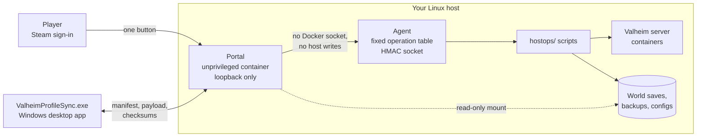
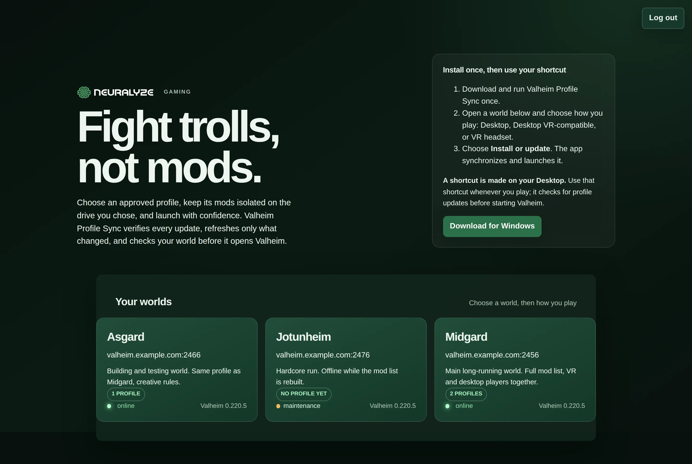
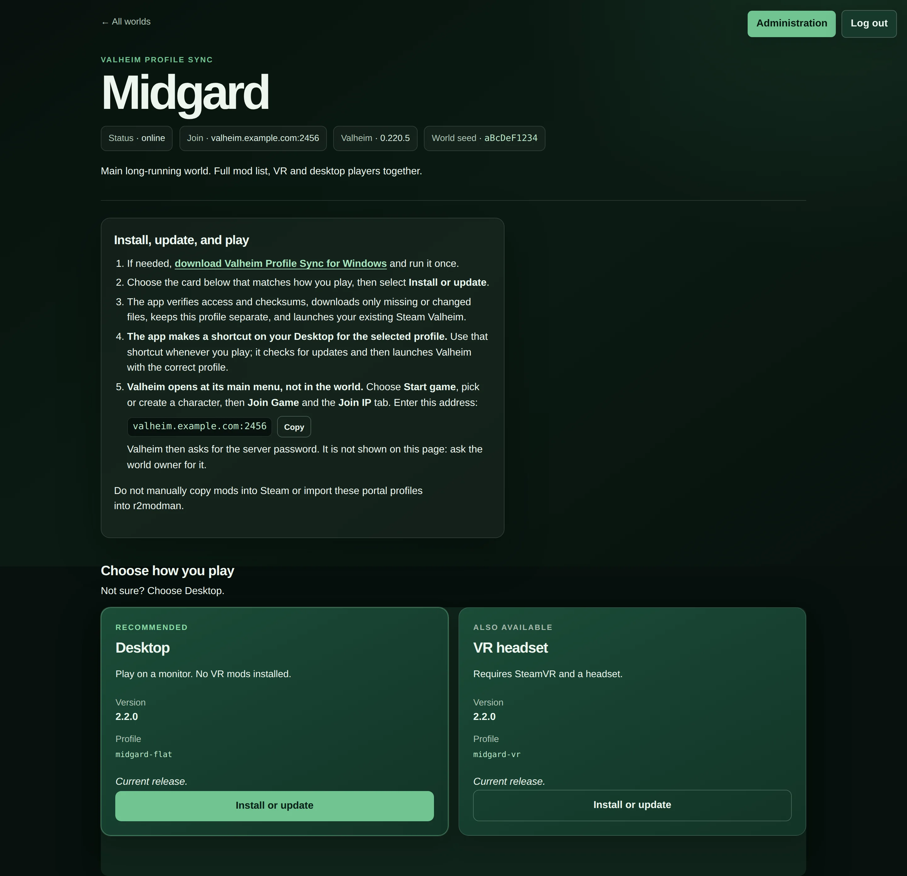
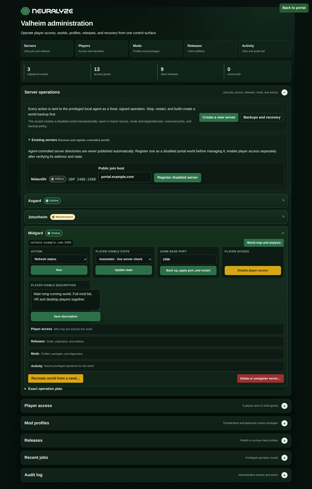
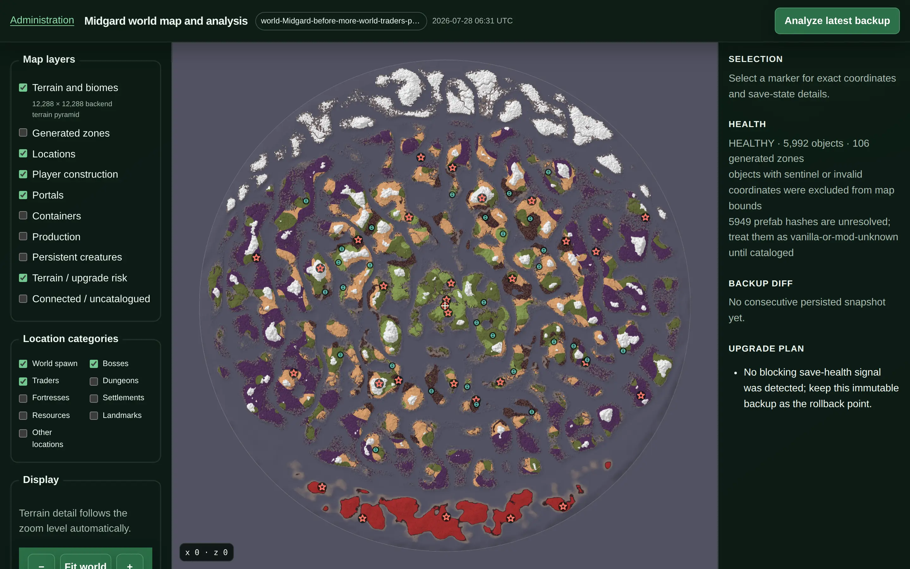

# Valheim Portal

### *Fight trolls, not mods.*

[](LICENSE)
[](go.mod)
[](docs/prerequisites.md)
[](docs/client-install.md)

**Valheim Portal keeps a group of modded Valheim servers, and everyone who plays on
them, on exactly the same mod list — without asking any player to touch a mod
manager.**

Running a modded Valheim server for friends is mostly an exercise in version drift.
Somebody updates one plugin, somebody else never updated at all, and the evening is
spent diffing `BepInEx/plugins` over voice chat instead of playing. The usual answer is
"install r2modman and import this code", which works right up until the code changes.

This project takes the other route. The operator publishes an **immutable profile
release** — an exact package list with a SHA-256 for every archive — and each player
gets one desktop application that installs precisely that, verifies every byte,
activates it atomically, and launches Steam Valheim. Players click one button on a web
page. They never see a mod list, never pick a version, and cannot end up with a
different one.

Reasons you might want it:

* **Nobody drifts.** A release is a scope — world, profile, client type, version — and
  the client either has that exact generation installed or installs it. A failed or
  interrupted update leaves the previous working generation active.
* **Flat and VR from the same world.** Both client types can be published for one
  world, so a VR player and a desktop player join the same server with profiles that
  agree about what is loaded.
* **Access is Steam identity, not a shared password.** Players sign in with Steam;
  the operator grants access per world. Profile links carry no token, no path, and no
  secret, so a leaked link grants nothing.
* **Server operations without a shell.** Start, stop, back up, restore, change ports,
  deploy mods, create and delete worlds — from an admin page, each as a fixed,
  backup-first sequence with typed confirmations on the destructive ones.
* **Privilege is separated on purpose.** The web process holds no Docker socket and
  writes nothing on the host. Everything privileged goes through a small agent that
  accepts only a fixed table of operations over an HMAC-authenticated socket.

It is single-tenant by construction: one operator, one host, a handful of worlds. It is
not a hosted service and does not try to be.

Licensed under **AGPL-3.0** — see [LICENSE](LICENSE). If you run a modified copy as a
network service, you owe its source to its users.



## What it does

| Area | Capability |
|---|---|
| **Profiles** | Immutable releases scoped by world, profile, client type and version, with a SHA-256 for every archive |
| **Client types** | Desktop, Desktop VR-compatible, and VR headset profiles for the same world |
| **Player access** | Steam OpenID sign-in, per-world grants, RFC 8628 device authorisation with a typed confirmation code |
| **Installation** | Atomic profile generations, resumable downloads, checksum verification, rollback to the previous generation |
| **Server operations** | Start, stop, pause, restart, back up, restore, change ports, capture logs and diagnostics |
| **World lifecycle** | Transactional creation from a seed or an imported save, registration, permanent deletion behind a typed phrase |
| **Mods** | Thunderstore and custom package management, dependency resolution, deploy with a reviewed diff |
| **Live status** | Online/offline measured from each container's own Steam A2S report, not an operator toggle |
| **World intel** | Rendered world maps, biome and location analysis, seed metadata |
| **Auditing** | Every privileged action recorded with actor, target and timestamp |

## What it looks like

A player signs in with Steam and sees only the worlds they have been granted.



Opening a world offers one card per client type. The card copy is derived from the
published profile definition rather than the release's `client_type`, so a profile
that installs ValheimVR can never be labelled plain Desktop.



The operator's side is one page. Every world exposes its lifecycle actions, access,
releases, mods and activity, and every button maps to a fixed, signed operation sent
to the privileged host agent.



Each world renders a browsable map from its own save file, with biome and location
layers, save-health analysis, and a diff against the previous backup.



## Repository layout

This repository is self-contained: clone it anywhere. It carries the Go portal, the
host operation scripts the agent executes, and the Python tools those scripts delegate
to.

```text
valheim-portal/
├── cmd/, internal/, client/   # the Go portal and its Windows client
├── hostops/                   # AGENT_SCRIPT_DIR: the 20 scripts the agent executes
│   ├── lib/common.sh          # shared resolvers every script sources
│   └── tests/                 # bash regression tests for the scripts
├── tools/                     # Python the scripts delegate to, plus the VR mod scanners
└── scripts/                   # installer and build tooling
```

Two directories stay outside it, because neither belongs to this project. **You set two
variables, once each:**

| Set this | To a directory like | Holding |
|---|---|---|
| `VALHEIM_WORLD_ROOT` | `/srv/valheim` | one subdirectory per world, plus `world_backups` — your save data |
| `VALHEIM_SERVER_DOCKER_DIR` | `/srv/valheim-server-docker` | a checkout of the modified [valheim-server-docker](https://github.com/lloesche/valheim-server-docker) fork, Apache-2.0, whose compose project every lifecycle script drives |

```text
/srv/valheim/                 <- VALHEIM_WORLD_ROOT points here
├── MyWorld/
├── AnotherWorld/
└── world_backups/
```

If you install with `scripts/install-portal.sh`, set both in `deploy/install.conf` and
you are done — the installer writes them into the container's `.env` and the agent's
`/etc/valheim-portal/agent.env` for you.

> **You may see two other names for the world root and you never set them.**
> `AGENT_WORLD_ROOT` is what the installer hands the agent process, and `VALHEIM_ROOT`
> is what the `hostops/` scripts call it internally. All three mean the same directory;
> the scripts accept whichever is present. Set `VALHEIM_WORLD_ROOT` and ignore the rest.

Neither has a default. A script that needs one and does not find it exits 78 with a
message naming the variable and showing the layout it expects, rather than guessing a
path it would then stop or delete a server in. See
[docs/repository-layout.md](docs/repository-layout.md); versions and host requirements
are in [docs/prerequisites.md](docs/prerequisites.md).

**Build gotcha.** If your checkout happens to sit inside another VCS working copy, plain
`go build ./...` fails with `multiple VCS detected`. Use:

```sh
go build -buildvcs=false ./...
```

The shipped build scripts already pass it.

## Installation

Written to be followed by a person or by an agent. Every step has a command to run and a
command that proves it worked; where a step can fail quietly, the failure is named next to
it. If a verification does not print what it says here, stop there rather than continuing.

### Before you start

Check each of these rather than assuming. The right-hand column is what a missing one costs.

```sh
go version          # need go1.26.5 or newer; the installer builds the agent from source
docker compose version   # need Compose v2; the scripts call `docker compose`, not `docker-compose`
python3 --version   # need 3.11+; the mod tooling is Python
sqlite3 --version   # used by the release and profile tooling
shellcheck --version     # only needed to run the checks, not to install
id -u               # the installer needs root; run it with sudo
```

### 1. Clone this repository and the server checkout its scripts drive

```sh
git clone https://github.com/neuralyze/valheim-portal.git /srv/valheim-portal
cd /srv/valheim-portal
git clone https://github.com/lloesche/valheim-server-docker.git /srv/valheim-server-docker
printf 'PUID=1000\nPGID=1000\n' > /srv/valheim-server-docker/default.env
```

Verify: `test -f /srv/valheim-server-docker/docker-compose.yaml && echo ok`

The second checkout is a separate Apache-2.0 project and is deliberately not vendored.
Without it, every lifecycle script exits 78 naming `VALHEIM_SERVER_DOCKER_DIR`.

### 2. The two operator data files

```sh
cp hostops/worlds.txt.example hostops/worlds.txt
cp release-targets.json.example release-targets.json
# edit both to your real worlds before continuing
```

Verify: `grep -c . hostops/worlds.txt` prints one line per world you intend to operate, and
`python3 -c 'import json;print(len(json.load(open("release-targets.json"))["vr"]))'` prints
the number of VR targets you declared.

**This is the step that fails silently.** A world missing from `hostops/worlds.txt` is never
backed up *and the run still reports success*. An absent or empty `release-targets.json`
makes the client-release cutover guard find no targets, so a server can start without a
package that every player's installed release still expects.

### 3. Deployment configuration

```sh
cp deploy/install.conf.example deploy/install.conf
# set: base URL, trusted proxy CIDR, world root, server checkout, allowed worlds
```

Verify: `grep -E '^(PORTAL_PUBLIC_BASE_URL|VALHEIM_WORLD_ROOT|VALHEIM_SERVER_DOCKER_DIR)=' deploy/install.conf`
prints all three with real values. None has a default: a script that needs one and does not
find it exits 78 naming the variable, rather than guessing a path it would then stop or
delete a server in.

Two optional decisions live in that file and are cheapest to make now, though either can be
turned on later with one line and a reinstall: `PORTAL_ENABLE_AGENT_BRIDGE` to let an agent drive
the portal, and `AGENT_RUNNER_SERVICE` to run that agent as a poller rather than on demand. See
[Agent operation](#agent-operation).

### 4. Preview, then install

```sh
sudo ./scripts/install-portal.sh install --config deploy/install.conf --dry-run
sudo ./scripts/install-portal.sh install --config deploy/install.conf
```

Verify: `curl -fsS http://127.0.0.1:18080/healthz` prints `ok`, and
`docker ps --format '{{.Names}}' | grep valheim-portal` lists the container.

### 5. Reverse proxy, then prove the boundary

Point your proxy at `127.0.0.1:18080`. It must send `X-Portal-Admin-Token` on `/admin` and
blank both identity headers everywhere else. Then:

```sh
sudo ./scripts/install-portal.sh verify --config deploy/install.conf
```

Verify: the command exits 0. A non-zero exit names the specific boundary that failed; do not
continue past it, because the failure modes are "the admin surface is reachable without the
token" and "player routes can assert an identity".

### 6. Check the build the way CI does

```sh
scripts/check.sh          # thirteen gates, first failure wins, ~1 minute cold
scripts/check.sh --list   # what they are
```

Verify: the last line reads `all gates passed`. A failure names the gate and the command to
reproduce it — `scripts/check.sh --only <gate>`.

The full walkthrough — prerequisites in detail, the proxy configuration, the security model,
upgrades and troubleshooting — is in [docs/installation.md](docs/installation.md).

## Working in this repository, as a person or as an agent

Three checkouts of this project can exist on one host and they are not
interchangeable. Before running anything, know which one you are in:

```text
the dev checkout      where code changes belong; this is what pushes to GitHub
/srv/valheim-portal   the host copy the installer deploys and the agent's scripts run from
the live deployment   whatever directory the running compose project was created in
```

`docker inspect <container> --format '{{index .Config.Labels "com.docker.compose.project.working_dir"}}'`
answers which directory is serving players. Confusing them has cost real time here: a fix was
once read out of a stale checkout and reported as shipped.

**Never write directly to:**

```text
/srv/valheim-portal                      the deployed copy; change the dev checkout and reinstall
<world root>/<World>/config_merged       generated; change it through hostops/manage_mods.sh
<world root>/<World>/worlds*             player saves
any .env in a world directory            production secrets
```

And never run `git clean` in a world directory: untracked files there include live
configuration.

The repository's law for automated work is [CLAUDE.md](CLAUDE.md) — what may be written,
which actions need an operator, and the evidence rules. `AGENTS.md` is **not** it here: this
checkout excludes that file locally because the build system generates it, so anything
written there would be overwritten and would never reach a clone.

## How it works

The portal publishes Steam-authorized, immutable Valheim profile definitions and
operates a restricted server-management agent. It holds no Docker socket and writes
nothing on the host; it does mount the world tree read-only, which is how it reads
seeds, maps, and live world status. See
[docs/architecture.md](docs/architecture.md).

## Player workflow

1. Download and double-click `ValheimProfileSync.exe` once. It installs and registers itself with a visible confirmation.
2. Sign in through Steam at the portal.
3. Open an authorized world page and select **Install or update** for a profile.
4. The `valheim-profile-sync://` link starts the installed application, which shows a
   short eight-character code. Type that code into the browser's confirmation page and
   submit it.

   Opening the page authorizes nothing on its own — the code, visible only on your own
   screen, is what turns the request into a grant.

5. On the first update the application looks for Valheim in saved, registry and standard
   Steam locations. If none is valid, pick the folder containing `valheim.exe` yourself;
   **Done** stays disabled until validation succeeds. That choice is remembered.

6. It then downloads only missing or changed packages, validates every checksum,
   activates the profile atomically, creates a `<profile>.url` Desktop shortcut, and
   starts Steam Valheim.

The application stores independent profile generations under `%LOCALAPPDATA%\ValheimProfileSync\profiles`. It never copies the Steam game. It installs only the Doorstop bootstrap files required to select a profile beside `valheim.exe`; it refuses to replace a loader owned by another tool.

VR releases also carry a separate, immutable `vr_runtime` artifact. The client checksum-verifies and stages it outside Steam, then overlays only tracked ValheimVR runtime files. Switching to Flat removes only checksum-verified portal-owned runtime files; unknown or foreign files cause a safe refusal. See [ValheimVR packaging](docs/valheimvr-packaging.md).

VR-compatible Flat and VR definitions retain ValheimVR's multiplayer animation support: Flat sets `nonVrPlayer = true` and includes the non-VR companion; VR sets it to `false` and includes `vr_runtime`. True nonVR definitions use the Flat transport type but omit ValheimVR, `BackpacksVRFix`, `EpicLootVRFix`, ValheimVR configuration, and every ValheimVR artifact.

## Deployment

The portal is two deployables: an unprivileged loopback-only container and a
privileged host agent that runs a fixed table of world operations behind an
HMAC socket. Provision both with the installer:

```sh
cp deploy/install.conf.example deploy/install.conf
sudo ./scripts/install-portal.sh install --config deploy/install.conf --dry-run
sudo ./scripts/install-portal.sh install --config deploy/install.conf
```

See [prerequisites.md](docs/prerequisites.md) for what the host needs first,
[installation.md](docs/installation.md) for the security model the deployment
depends on, and [public-distribution.md](docs/public-distribution.md) for what
remains before this can be offered as a turnkey public solution. The world
operation scripts ship in `hostops/`; the installer verifies every one the agent
can invoke is present and executable before it changes anything.

Every command and build script in this repository is listed in
[command-reference.md](docs/command-reference.md); every world operation script in
`hostops/` and every Python tool in `tools/` has an entry in
[script-reference.md](docs/script-reference.md).

## Administration

Sign in with Steam: the **Administration** link appears for any SteamID64 listed in
`PORTAL_ADMIN_STEAM_IDS`, which the portal checks against the signed-in identity
itself. The reverse-proxy identity and admin-token path is retained as break-glass,
and an empty allowlist leaves it as the only way in — see
[the security model](docs/installation.md#the-security-model).

The authenticated admin site is one page of collapsible sections, ordered so server
operations come first:

* **Membership** — grant or revoke per-world access by Steam ID, and set who is an
  admin on each world. Unregistering revokes portal access without touching server
  files.
* **Server operations** — start, stop, pause, restart, back up, change the game port,
  capture logs and diagnostics. Anything that interrupts play is backup-first.
* **Mods** — manage Thunderstore and custom packages against a world's profile, then
  deploy with a reviewed diff.
* **Releases** — create, publish, batch-publish, discard and archive immutable profile
  releases and their artifacts.
* **World creation** — a random or supplied seed, or an imported save pair; copies an
  approved profile manifest, sets network, gameplay and backup values, starts the world
  with a readiness check, and publishes it only once healthy. The whole sequence is
  transactional.
* **Deletion** — requires typing an exact world-bound phrase, then disables access,
  takes a final backup, stops the server, removes its directory and archives its
  releases. External backups and immutable artifacts are retained.
* **World map and analysis** — rendered maps, biome and location analysis, seed
  metadata.
* **Server logs** — the tail of each world's collected host log, with a filter and a download,
  read from the file that survives a restart and a removed container rather than from the live
  container. See [docs/operations.md](docs/operations.md) for rotation, which is not optional.
* **Audit log** — every privileged action with actor, target and timestamp.

## Agent operation

The portal can be driven by an AI agent through a fixed, gated surface: an operator chats to
it on `/admin/agent`, and it manages mods, profiles and worlds by requesting **verbs**. The
portal — not the agent — decides what is allowed and records what happened.

The lane is drawn mechanically, because prose did not hold. This project spent a working day
with an agent that had standing instructions and violated them repeatedly: nine plugin
releases chasing one behaviour, a client manifest overwritten unread, a setting shipped
inverted, work published while the operator was still asking a question. What stopped it was
not a rule; it was a hook that refused a write and a policy layer that refused a capability.

### The verbs

[`policy.yaml`](policy.yaml) is the authoritative definition: every verb, its approval class,
its preconditions, its evidence requirement. As of 15 Aug 2026:

<!-- verb-counts: checked by tools/check_agent_policy.py -->
```text
25 verbs declared
18 execute through the portal today
 3 refused by design      repo_edit, plugin_build (the agent's own workspace), world_restore
 4 forbidden              upstream_push, delete_server, provision, secrets_read
```

Approval is decided by class, not by the agent's argument for it:

| class | approval | covers |
|---|---|---|
| `read` | none | status, logs, manifests, changelogs, deploy plans |
| `repo_write` | none | code and builds in the agent's own checkout |
| `world_state` | **every invocation** | mods, deploys, starts, stops, backups |
| `player_facing` | **every invocation** | publishing a profile players download |
| `forbidden` | never | enforced by absence — no credential, no write access |

A deploy whose plan shows no changes is refused rather than confirmed: it would stop a world
to change nothing.

### Turning it on

The bridge is off until a deployment opts in, and the installer owns both halves: the token the
portal reads, and the runner that drives it. Nothing here is hand-made.

```sh
# 1. omp owns authentication. The portal stores no model keys and never sees one.
omp setup
omp auth-broker login <provider>
omp auth-broker status            # verify: your account is listed

# 2. Opt in, then reinstall. The installer generates the bridge token, mounts it into
#    the container, installs the runner, and sets up both ways of running it.
echo 'PORTAL_ENABLE_AGENT_BRIDGE=true' >> deploy/install.conf
sudo ./scripts/install-portal.sh install --config deploy/install.conf
```

Verify: the install prints `agent bridge: enabled` and `installed /usr/local/bin/valheim-agent-runner`.
If it prints `agent bridge: disabled`, the line above landed in the wrong file.

**Two ways to run the runner. An install sets up both, and you can switch without reinstalling.**

On demand — the default, and the right choice for a portal nobody is watching. One pass, then it
exits:

```sh
sudo systemctl start valheim-agent-runner-once
journalctl -u valheim-agent-runner-once -n 20 --no-pager
```

Verify: the log reads like `agent-runner: 25 verbs, 18 available, cursor 0`, then
`one pass done`. The verb count comes from the portal, so a wrong number means the runner is
talking to a portal you did not expect.

Polling — for a portal you want driven continuously:

```sh
echo 'AGENT_RUNNER_SERVICE=true' >> deploy/install.conf
sudo ./scripts/install-portal.sh install --config deploy/install.conf
journalctl -u valheim-agent-runner -f
```

Verify: `systemctl is-enabled valheim-agent-runner` prints `enabled`. Setting it back to `false`
and reinstalling stops and disables it — the switch is authoritative, not advisory.

Both units read `/etc/valheim-portal/agent-runner.env`, so an on-demand pass is a rehearsal of
what the poller does rather than a different configuration. Neither runs as the agent account:
the runner shells out to omp, which keeps its login in a home directory, so it runs as an
operator account that can reach neither the world tree nor the docker socket.

### Driving it

Open `/admin/agent` and send a message. **Sending is the trigger** — a pass starts on its own,
and so does one when you Approve or Deny, so approved work continues without a second step.

That works without giving the portal any host access. The portal writes a file in its own data
volume; a systemd path unit watches the host side of that file and starts
`valheim-agent-runner-once.service`. The portal cannot start a unit — it has no Docker socket and
no host reach, which is the point of the split — so systemd owns the reaction.

To run a pass by hand, which is what you want when checking wiring or after editing configuration:

```sh
sudo systemctl start valheim-agent-runner-once
systemctl status valheim-agent-runner-wake.path    # verify: active (waiting)
```

The wake watcher is installed with the bridge and turned off in polling mode: two triggers for one
job would let a single message be answered twice.

**The page updates itself. Do not refresh.** It polls a two-field state token every 5 seconds
while something is pending and every 30 seconds when idle, reloads only when that token changes,
and never reloads while there is text in the message box — a half-written message vanishing reads
as a broken page, so it says "new activity - reload when you are done typing" instead.

Polling mode removes the trigger step: send a message and the answer arrives on its own.

Failure text, and what each one means:

| You see | It means |
|---|---|
| `The agent bridge is disabled. Set PORTAL_AGENT_BRIDGE_TOKEN_FILE…` | the deployment never opted in — `PORTAL_ENABLE_AGENT_BRIDGE=true` and reinstall |
| `agent bridge disabled; set PORTAL_AGENT_BRIDGE_TOKEN_FILE` (503) | same cause, seen by the runner instead of the page |
| `bridge token required` (401) | the token is configured but the runner presented a wrong or absent one |
| `dial unix /run/agent/agent.sock: no such file or directory` | the container's mount on the agent's runtime directory is stale — see [operations.md](docs/operations.md#when-the-portal-cannot-reach-the-agent). `curl -fsS localhost:18080/readyz` confirms it; reinstalling repairs it |
| `not available through the portal: …` (501) | the verb is declared but has no host operation; the message names what is missing |
| `forbidden by policy` (403) | not negotiable, and no argument changes it |
| `Unit valheim-agent-runner-once.service not found` | the bridge is off, so no runner was installed |
| nothing happens at all | the wake watcher is not running — `systemctl status valheim-agent-runner-wake.path`. Reinstalling installs it; a pass by hand is the workaround |

### What the operator sees

`/admin/agent` lists every request with its class, status, full arguments, and the evidence the
portal read back from the host — not the agent's summary of it. Mutating requests wait there
with **Approve** and **Deny**. A publish approval is shown against what that world already
serves and how many releases have gone out in the last day, which is the brake that replaces
publish limits.

The page keeps itself current, and will not reload while you are typing a message.

### Tasks and durable facts

Outstanding work lives in [beads](https://github.com/gastownhall/beads), not in a chat log:

```sh
bd list --status=open     # what is actually outstanding
bd ready                  # what can be started
```

A fresh clone bootstraps its own tracker. Note the flag:

```sh
bd init --remote ''       # the empty remote matters
```

Without it, `bd init` inherits the nearest parent workspace's sync remote and clones that
project's issues — 848 of them, twice, when this was set up. `tools/check_beads_workspace.py`
fails the build if the local tracker is not this project's.

### The checks that keep it honest

```sh
python3 tools/check_agent_policy.py     # policy.yaml, the docs and the Go verb table agree
python3 tools/check_perframe_work.py    # no unbounded scene search on a per-frame path
python3 tools/check_beads_workspace.py  # the tracker belongs to this project
```

The first is the one that matters most for this section: it fails when `policy.yaml`, the verb
table in `internal/app/verbs.go`, and the documented tables disagree — including the counts
above. The details are in [docs/agent-harness.md](docs/agent-harness.md).

## Profile releases

A release is scoped by world, profile, client type (`flat` or `vr`), and version. Multiple profiles for the same world and client type may be current simultaneously.

Build a deterministic profile definition from an approved managed profile manifest and client config:

```sh
./scripts/build-profile-definition.sh \
  <WORLD> <published-profile> flat \
  '<world-root>/<WORLD>/mods/profiles/<source-profile>/profile-manifest.json' \
  '<world-root>/<WORLD>/mods/profiles/<source-profile>/client-config' \
  '<world-root>/<WORLD>/mods/manager/exports/<published-profile>-profile-<version>.zip' \
  '<world-root>/<WORLD>/mods/profiles/<source-profile>/client-config-flat'
```

The three-argument form `build-profile-definition.sh <WORLD> <published-profile> flat`
derives all of those paths from `VALHEIM_PROFILE_SOURCE_ROOT`.

The builder resolves enabled package pins from the managed manifest, records each package SHA-256 and size, merges the optional client-type config overlay over the common config, and creates a canonical `profile-manifest.json` plus profile config ZIP. Build the Windows application with:

```sh
./scripts/build-windows-client.sh
```

`dist/ValheimProfileSync.exe` is tracked, because it is what the portal serves
at `/client/ValheimProfileSync.exe`. Always produce it with that script: a plain
`go build` links the console subsystem, so Windows opens an empty console window
beside the application, and it leaves the build identity unstamped so a support
bundle cannot be matched to a release. Two checks enforce this rather than
trusting the habit — `go test ./cmd/valheim-profile-sync` rejects a tracked
artifact that is console-linked, unstamped, or unstripped, and the portal refuses
to serve one, reporting the reason on `/admin` and to the download.

Publish a profile from the authenticated `/admin` release workflow. It uploads artifacts through the portal process and is the recommended production path.

`seed-release` is only for controlled host automation. Its `--database` and `--artifact-root` values are persisted in the release record and later opened by the portal container. Therefore, run it **inside a container that mounts `portal-data` at `/var/lib/valheim-portal`**:

Build the staging utility, then mount it with the production data volume:

```sh
go build -buildvcs=false -trimpath -o /tmp/seed-release ./cmd/seed-release
```

```sh
docker run --rm --user root \
  --entrypoint /seed-release \
  -v portal_portal-data:/var/lib/valheim-portal \
  -v /path/to/seed-release:/seed-release:ro \
  -v /absolute/path/<published-profile>-profile-<version>.zip:/tmp/profile.zip:ro \
  debian:bookworm-slim \
  --database /var/lib/valheim-portal/portal.sqlite \
  --artifact-root /var/lib/valheim-portal/artifacts \
  --world <WORLD> \
  --profile <published-profile> \
  --client-type flat \
  --version <version> \
  --profile-payload /tmp/profile.zip \
  --join-address 'valheim.example.com:2456' \
  --server-version '<verified Valheim server version>'
```

For VR, mount the validated runtime archive, add `--vr-runtime /tmp/vr-runtime.zip`, and use client type `vr`.

Never pass host paths such as `/var/lib/docker/volumes/portal_portal-data/_data/...` as either argument. They are valid only on the host, fail the portal container's path-containment check, and cause an authenticated client payload request to return `404`.

`seed-release` safely resumes only an exact matching incomplete draft. Archive a bad release in `/admin`; published history remains auditable. A failed local update keeps the previous profile generation active.

## Documentation

| doc | read it when |
|---|---|
| [docs/repository-layout.md](docs/repository-layout.md) | Before cloning. The required layout and the `-buildvcs=false` gotcha. |
| [docs/prerequisites.md](docs/prerequisites.md) | Before installing. Versions, ports, DNS/TLS, and what an absent Steam API key costs you. |
| [docs/installation.md](docs/installation.md) | Installing. The security model the deployment depends on. |
| [docs/operations.md](docs/operations.md) | Running it. Releases, world operations, player access, and how world status is measured. |
| [docs/development.md](docs/development.md) | Changing it. What a clean clone can and cannot verify. |
| [docs/agent-harness.md](docs/agent-harness.md) | Letting an agent operate it. The verb surface, the approval classes, the bridge API, the runner, and what it may never decide. |
| [policy.yaml](policy.yaml) / [CLAUDE.md](CLAUDE.md) | The authoritative verb and approval definition, and the law automated work follows in this repository. |
| [docs/command-reference.md](docs/command-reference.md) | Every command in `cmd/` and every script in `scripts/`. |
| [docs/architecture.md](docs/architecture.md) / [docs/threat-model.md](docs/threat-model.md) | Reviewing the design or its boundaries. |
| [docs/client-install.md](docs/client-install.md) | Helping a player install a profile. |
| [docs/release-format.md](docs/release-format.md) / [docs/valheimvr-packaging.md](docs/valheimvr-packaging.md) | Building or publishing artifacts. |
| [docs/public-distribution.md](docs/public-distribution.md) | Asking what is still rough about this as a public product. |

## Valheim, VHVR and mod compatibility

A modded Valheim client fails quietly: the mod installs, the game starts, and the feature
is simply dead in VR with no error anywhere. These five documents are the accumulated
answer to that, and they are useful even if you never deploy this portal.

| doc | the problem it solves |
|---|---|
| [docs/valheim-vr-knowledge.md](docs/valheim-vr-knowledge.md) | You need a fact about Valheim or VHVR internals and the documentation does not have it, or has it wrong. Verified against decompiled IL with `file:line` citations. Its first section is about instruments that silently read zero, and generalises past this game. |
| [docs/mod-onboarding.md](docs/mod-onboarding.md) | You want to add a mod without discovering months later that it never worked in VR. Eight stages, three gates, one recorded decision. |
| [docs/mod-decisions.md](docs/mod-decisions.md) | Someone is about to re-add a mod that was removed on purpose, or unpin a version that is pinned for a reason. |
| [docs/mod-compatibility-register.md](docs/mod-compatibility-register.md) | A package is breaking your profile and you would rather not repeat the bisection. Confirmed root causes are kept separate from packages merely bisected out. |
| [docs/vr-impact-scan.md](docs/vr-impact-scan.md) | You want the first pass automated. Documents `tools/vr_impact_scan.py`, which walks mod IL for the seven known VHVR-incompatibility classes, and `tools/vr_perf_ingest.py`, which turns a client diagnostics bundle into per-mod cost. Both exit non-zero on findings, so they gate in CI. |

## Contributing and security

[CONTRIBUTING.md](CONTRIBUTING.md) has the local check loop and the layout rules.
[CODE_OF_CONDUCT.md](CODE_OF_CONDUCT.md) applies to every interaction here.

**Do not report security issues in a public issue.** See [SECURITY.md](SECURITY.md):
the host agent runs privileged host scripts, so a bypass of the admin check, the agent
socket, or the world allowlist is host privilege escalation, not a web bug.

## Release integrity

Windows client releases are built by GitHub Actions from a tagged commit in this repository
([`.github/workflows/release-client.yml`](.github/workflows/release-client.yml)) and published as
release assets with a `SHA256SUMS` file, so any download can be checked against the artifact this
repository produced:

```powershell
Get-FileHash .\ValheimProfileSync.exe -Algorithm SHA256
```

Builds use `-trimpath -buildvcs=false`, so the same commit rebuilds to the same bytes: anyone can
rebuild a release themselves and compare digests rather than taking the published binary on trust.

Releases are currently **unsigned**. A certificate from a public authority requires either a paid
subscription or an HSM-backed key, and the free foundation programme for open-source projects
expects a project with an established user base. An unsigned binary that downloads and launches
other binaries is exactly the shape heuristic scanners object to, so
[docs/code-signing.md](docs/code-signing.md) documents what the client does, what was changed to
stop it resembling a dropper, and how to sign it if a certificate becomes available —
`scripts/sign-windows-client.sh` is wired into the build and activates on the presence of
credentials. If a scanner does object,
[docs/defender-false-positive.md](docs/defender-false-positive.md) is the report that clears a build
for every Defender installation, free, and why it should not need repeating often.

## Privacy policy

Valheim Profile Sync contacts exactly two kinds of host, both required to do its job, and reports
nothing to anyone else:

| destination | why | what is sent |
|---|---|---|
| the portal you install from | list worlds and profiles, authorize you, fetch profile releases | your Steam ID, for the operator's allowlist and admin checks |
| `gcdn.thunderstore.io` | download the mod packages a profile names | nothing but the package request |

It contains no analytics, no telemetry, no crash reporting, and no third-party SDKs. Diagnostics
bundles are produced only when you ask for one, are written to your own disk, and are uploaded only
if you choose to send them. It writes to your Valheim installation, its own profile directory, and a
Desktop shortcut — nothing else, and no other application's data.

